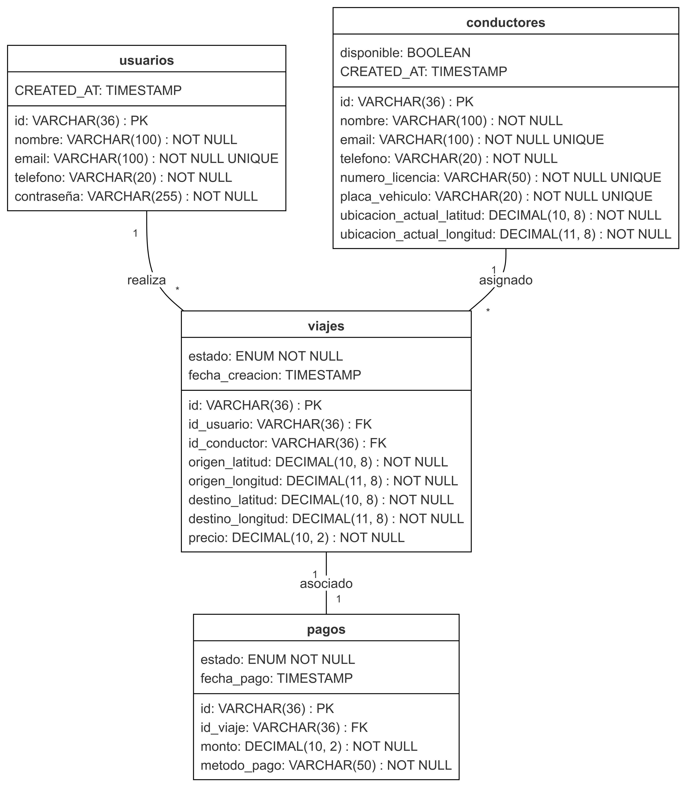
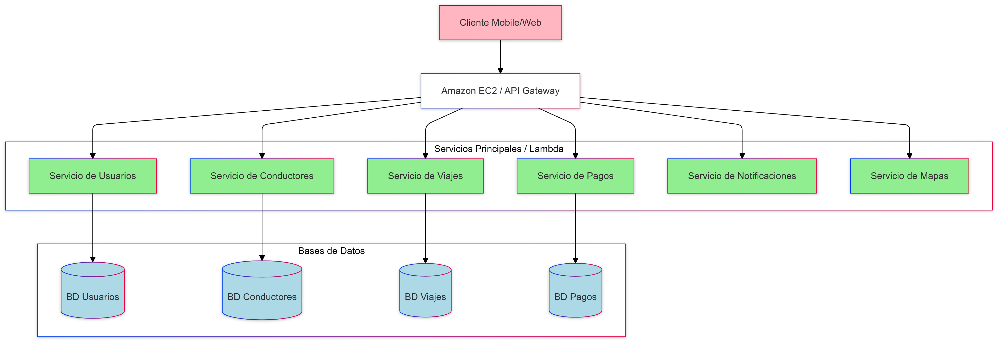
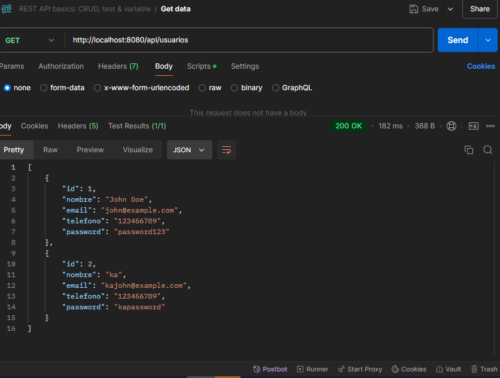
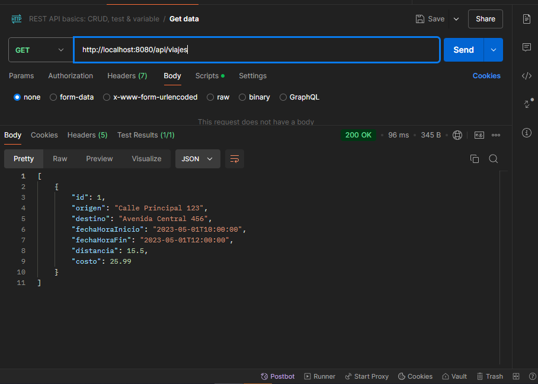
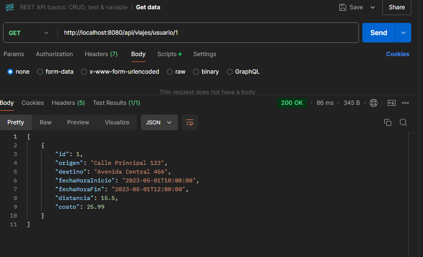

Arquitectura de Microservicios para una Plataforma de Viajes Compartidos
Descripción General
Este proyecto presenta una arquitectura de microservicios para una plataforma de viajes compartidos, como Uber. La arquitectura está diseñada para ofrecer escalabilidad, comunicación en tiempo real 

Estructura de los Endpoints (URIs)

Usuarios:
- POST /api/usuarios - Registro de usuarios
- GET /api/usuarios/ - Obtener todos los usuarios
- GET /api/usuarios/{id} - Obtener perfil
- PUT /api/usuarios/{id} - Actualizar perfil
- DELETE /usuarios/{id}: Eliminar un usuario

Conductores:
- POST /api/conductores - Registro
- GET /api/conductores/{id} - Obtener perfil
- PUT /api/conductores/{id} - Actualizar perfil
- PUT /api/conductores/{id}/ubicacion - Actualizar ubicación

Viajes:
- POST /api/viajes - Solicitar viaje
- GET /api/viajes/usuario/{id} - Obtener detalles del viaje de un usuario
- GET /viajes- Listar todos los viajes

Pagos:
- POST /api/pagos - Crear pago
- GET /api/pagos/{id} - Obtener detalles
- GET /api/pagos/viaje/{tripId} - Pagos por viaje

Arquitectura de Microservicios
La arquitectura de microservicios propuesta consta de los siguientes servicios:

API Gateway: Punto de entrada único para los clientes, responsable de enrutar las solicitudes a los microservicios apropiados.
Servicio de Usuario: Gestiona la información de los usuarios, incluyendo registro, autenticación y actualización de perfiles.
Servicio de Conductor: Administra la información de los conductores, su disponibilidad y asignación de viajes.
Servicio de Pago: Gestiona los pagos de los usuarios, incluyendo métodos de pago y procesamiento de transacciones.
Servicio de Notificación: Envía notificaciones en tiempo real a los usuarios y conductores sobre el estado de sus viajes y solicitudes.
Servicio de Viaje: Maneja la creación, actualización y consulta de viajes, así como su seguimiento en tiempo real.

Representación de Recursos

